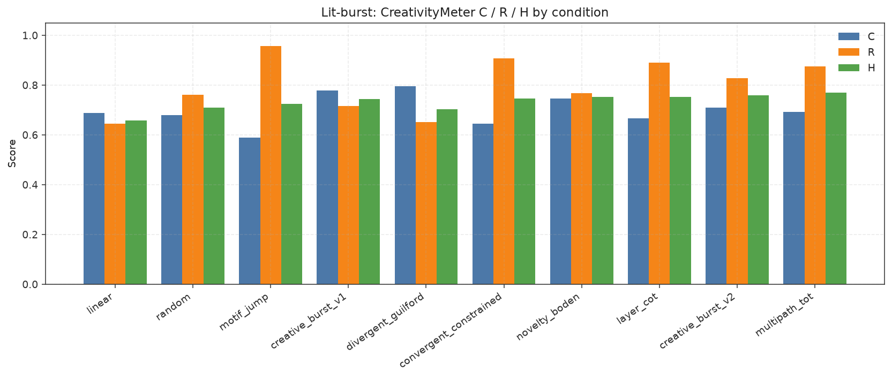
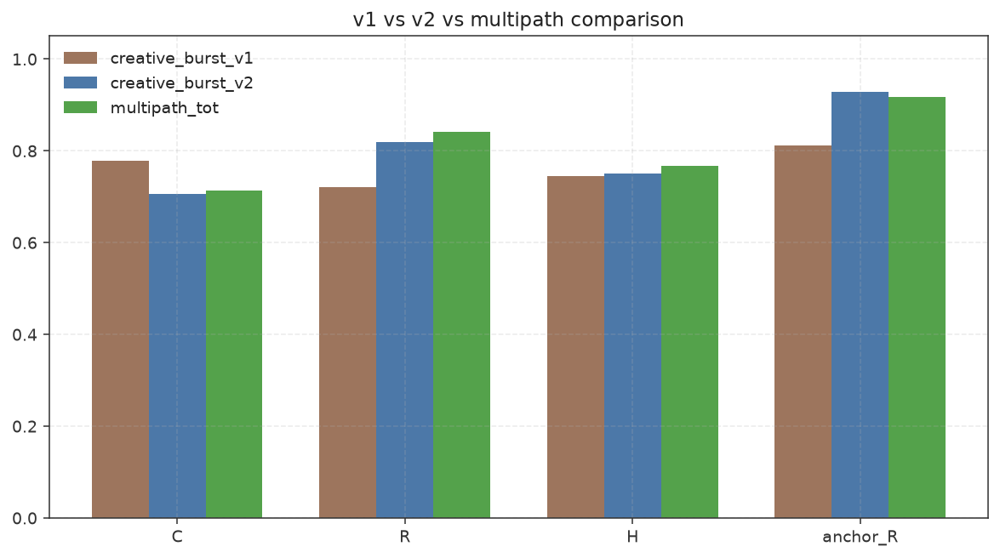
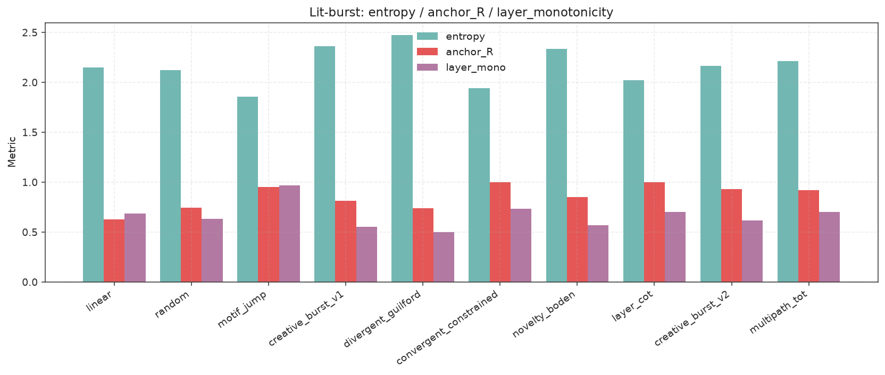
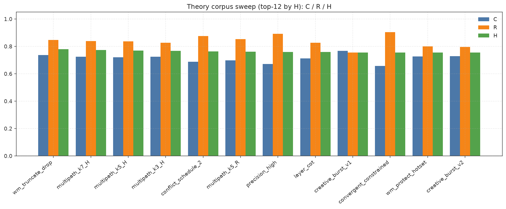
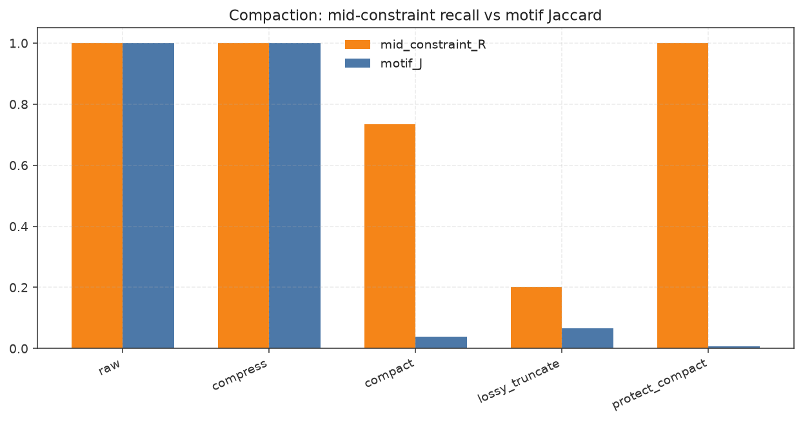
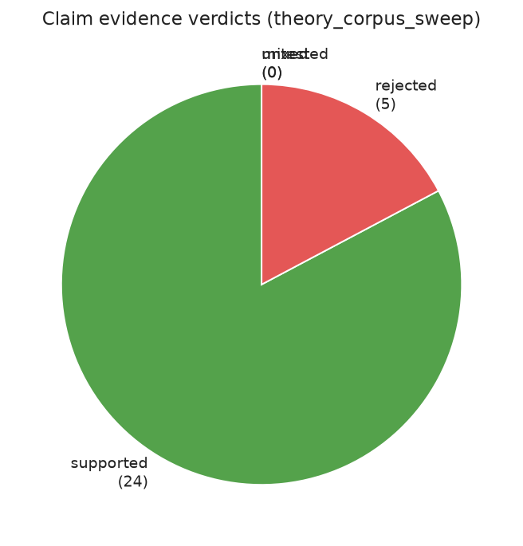

# Comprehensive Experimental Findings Report

**Package:** `intentisolates` ≥ 0.4.1  
**Compiled:** 2026-07-09 (UTC stamps below)  
**Stance:** Offline computational analogs — not claims that span hops *are* human cognition or that layer IV *is* residual-stream causality.

Companion artifacts: [COMPILED_EXPERIMENTATION_20260709.md](../experiments/results/COMPILED_EXPERIMENTATION_20260709.md) · [CHARTS.md](../experiments/results/CHARTS.md) · [CLAIM_EVIDENCE_TABLE.md](../experiments/results/CLAIM_EVIDENCE_TABLE.md) · **[ITERATIVE_REASONING_TRACE_TRAINING_REPORT.md](ITERATIVE_REASONING_TRACE_TRAINING_REPORT.md)** (10-epoch RT-guided loop) · [EPOCH_TRAJECTORY.md](../experiments/results/iterative_epochs/EPOCH_TRAJECTORY.md)

---

## 1. Executive summary

1. **`creative_burst_v2` improves reasoning fidelity** vs v1 (lit: R 0.820 > 0.721; sweep: 0.796 > 0.754) while keeping C near random (|Δ|≈0.05).
2. **`multipath` select-by-H is the best default when compute allows** (lit multipath_tot H=0.768; sweep multipath_k7_H=0.774, k5=0.769) — GWT/ToT analog held.
3. **Dual-process knobs behave as predicted:** divergent raises C/entropy; convergent raises R/`anchor_R` (P4 strong).
4. **Precision (`anchor_pull`) tracks predictive-processing-style tradeoff:** high precision ↑R, low precision ↑C (PP1/PP2 strong).
5. **Protect_compact (PromptDict) preserves mid-constraints** (mid_R=1.0 vs truncate 0.2); isolate-then-compact remains recommended for traces.
6. **Falsifiers matter:** offline WM truncate sim *rejected* P6 (artifact); incubation/two-phase *underperformed* fixed v2; do **not** change production knobs on those.
7. **Claim coverage:** 29 adjudicated checks → **24 supported / 5 rejected / 0 mixed / 0 untested** (causal B1/B2 only *weak* / mock-IV).

---

## 2. Background & theory corpus

| Doc | Role |
| --- | --- |
| [THEORY_CREATIVE_BURST_REASONING.md](THEORY_CREATIVE_BURST_REASONING.md) | Formal objects I,S,M,T,π,C,R,H; P1–P5 |
| [THEORY_HIGHER_COGNITION_GROUNDING.md](THEORY_HIGHER_COGNITION_GROUNDING.md) | Dual-process, WM, GWT, PP, conflict, analogy, insight, Soar/ACT-R |
| [THEORY_CAUSAL_KINETEQ_BRIDGE.md](THEORY_CAUSAL_KINETEQ_BRIDGE.md) | Meter↔IV↔Bridge/Kineteq orchestration crosswalk |
| [LIT_REVIEW_CREATIVITY_REASONING.md](LIT_REVIEW_CREATIVITY_REASONING.md) | Guilford, Mednick, Boden, CoT/ToT |
| [CREATIVE_BURST_IMPROVEMENTS.md](CREATIVE_BURST_IMPROVEMENTS.md) | v2 knobs / multipath |
| [FINDINGS_REASONING_TRACE_IMPROVEMENTS.md](FINDINGS_REASONING_TRACE_IMPROVEMENTS.md) | Prior lit findings |
| [../../docs/ISOLATES_COMPACTION_REASONING.md](../../docs/ISOLATES_COMPACTION_REASONING.md) | Protect / compress / truncate |
| [NEXT_EXPERIMENTS_REASONING_TRACE.md](NEXT_EXPERIMENTS_REASONING_TRACE.md) | RT1–RT11 queue (reasoning-trace R/H/IV) |
| [NEXT_EXPERIMENTS_HIGHER_COGNITION.md](NEXT_EXPERIMENTS_HIGHER_COGNITION.md) | E1–E10 cognition + bridge queue |

---

## 3. Methods

| Axis | Setting |
| --- | --- |
| Software | `intentisolates` src on `PYTHONPATH`; soft `promptdict`; soft `LayerCausalSuite` + `mock_iv` |
| Lit fixtures | 4 creative/planning texts (`span_burst_creative.FIXTURES`) |
| Sweep fixtures | 8 (creative, planning, constraint-heavy, tool-log, causal narrative) |
| Seeds | Lit: 3 offsets; Sweep: **5** per fixture×condition |
| Hops | 5 |
| Meter | `CreativityMeter` → C, R, H=2CR/(C+R), entropy, `anchor_R`, `layer_mono` |
| Adjudication | Mean direction + majority fixture sign wins |
| Reproduce | See §4 |

---

## 4. Experiment inventory

```bash
# from IntentIsolates/
python experiments/span_burst_creative.py
python experiments/lit_review_burst_experiments.py
python experiments/theory_corpus_sweep.py --seeds 5 --hops 5
python experiments/plot_results.py

# from PromptDictCompress/
python experiments/reasoning_trace_compaction.py
```

| Run | Stamp | Output |
| --- | --- | --- |
| span_burst | `20260709T234812Z` | `experiments/results/span_burst_*` |
| lit_burst | `20260709T234812Z` | `experiments/results/lit_burst_*` |
| theory_corpus_sweep | `20260709T235036Z` | `theory_corpus_sweep_*`, `CLAIM_EVIDENCE_TABLE.md` |
| reasoning_compaction | `20260709T234933Z` | PromptDictCompress `experiments/results/reasoning_compaction_*` |
| charts | regenerated | `experiments/results/charts/*.png` |

---

## 5. Results

### 5.1 Lit-burst C / R / H



| condition | C | R | H | anchor_R |
| --- | ---: | ---: | ---: | ---: |
| multipath_tot | 0.713 | 0.841 | **0.768** | 0.917 |
| layer_cot | 0.667 | 0.895 | 0.755 | 1.000 |
| creative_burst_v2 | 0.706 | 0.820 | 0.751 | 0.929 |
| convergent_constrained | 0.644 | 0.907 | 0.747 | 1.000 |
| creative_burst_v1 | 0.778 | 0.721 | 0.745 | 0.812 |
| random | 0.702 | 0.705 | 0.687 | 0.743 |



### 5.2 Structure metrics (lit)



### 5.3 Theory sweep (8×5×21)



Notable: `multipath_k7_H` H=0.774; `conflict_schedule_2` H=0.763 ≥ v2; `precision_high` R=0.891; `wm_truncate_drop` anomalous H=0.778 (see limitations).

### 5.4 Compaction



`protect_compact` mid_constraint_R=**1.000** vs `lossy_truncate` **0.200**; lossless `compress` keeps motif_J=1.0 with ratio≈1.46.

---

## 6. Claim evidence



| Verdict | Count |
| --- | ---: |
| supported | 24 |
| rejected | 5 |
| mixed | 0 |
| untested | 0 |

Full rows: [CLAIM_EVIDENCE_TABLE.md](../experiments/results/CLAIM_EVIDENCE_TABLE.md).

**Integrate only moderate+ supported into defaults** — current `for_v2` / multipath already match strongest claims (P1,P2,P5,L2,PP*,G*). Rejected P6/I1/I2 → **no** default change; revise WM protocol before re-test.

---

## 7. Insights (synthesized)

1. **Harmonic H is the right production objective** — peak at multipath select-by-H, not max-C.
2. **Anchors and novelty are a controllable tradeoff** (dual-process + precision knobs), not a single “creativity” scalar.
3. **Motif_jump maximizes R/mono but kills C** — keep as fidelity specialist, not ideation default.
4. **Layer bias (CoT) recovers planning-like mono** without collapsing H (P3, PL1).
5. **GWT/ToT k-sweep shows small but consistent H gains** k3→k5→k7 (G2/G3).
6. **Select-by-C is actively harmful to R** vs select-by-H (G1 ΔR≈+0.10).
7. **Conflict schedule (anchor every 2)** weakly helps H — optional tighter schedule for compliance traces.
8. **Incubation / naive two-phase schedules underperformed** offline at hop=5 — need longer budgets or better handoff.
9. **Isolate-aware compaction is settled** for mid-constraint recall; burst-after-compact needs a better WM sim than head/tail truncate.
10. **Causal bridge evidence is still weak** (mock IV / zero overlap proxy) — do not claim identification quality from meter alone.
11. **Side-hops raise C but tax R** — keep `side_hop_prob≈0.18` (v2) rather than insight-high 0.40.
12. **Cross-theory agreement:** dual-process convergent, high precision, and multipath-H all pull toward higher R; divergent / low precision / select-by-C pull toward C — meter H is the mediation point for Bridge broadcast.

---

## 8. Integration

| Change | Done? |
| --- | --- |
| Keep `CreativeBurstHopper.for_v2` defaults | **Yes** (evidence-aligned; no flip) |
| Prefer multipath select-by-`tradeoff_harmonic` when k≥3 | **Documented** (already API default) |
| Empirical status tables in THEORY_* | **Updated** (this compile) |
| Charts + compiled MD + comprehensive report | **This deliverable** |
| P6 WM protocol redesign | Deferred (rejected sim is not production evidence) |
| CausalBridge `isolates_burst_iv` workflow | Still proposal-only |

---

## 9. Limitations

- Offline proxies only; no LLM-as-judge / task checklist outcomes.
- Synthetic fixtures; small hop budget (5).
- `wm_truncate_drop` shrinks the pool toward remaining anchors → inflated `anchor_R` (P6 reverse result).
- Causal rows use `mock_iv` / name-overlap — exploratory.
- Kineteq live MCP not exercised (fallback/absent).
- Computational analogs ≠ identity with Kahneman/GWT/Friston mechanisms.

---

## 10. Recommendations & next experiments

**Production**

- Default path walk: `creative_burst_v2`.
- Under budget for quality: `multi_path_burst(..., k=5..7, select_by="tradeoff_harmonic")`.
- Compliance / high-R: convergent or `precision_high` knobs; ideation: divergent.
- Reasoning compaction: `protect_compact` / isolate-then-compact before burst.

### What’s next

Primary queue: **[NEXT_EXPERIMENTS_REASONING_TRACE.md](NEXT_EXPERIMENTS_REASONING_TRACE.md)** (RT1–RT11). Companion cognition/bridge list: [NEXT_EXPERIMENTS_HIGHER_COGNITION.md](NEXT_EXPERIMENTS_HIGHER_COGNITION.md).

**RT-guided iterative cycle completed** (`20260710T001218Z`): see [ITERATIVE_REASONING_TRACE_TRAINING_REPORT.md](ITERATIVE_REASONING_TRACE_TRAINING_REPORT.md). Epoch_0→9: H 0.753→0.779, R 0.828→0.897, mono 0.600→0.800. Elite: multipath k=7 H + protect + schedule=2 / pull≈0.80.

| Rank | Exp | Status after iterative cycle | Remaining work |
| --- | --- | --- | --- |
| 1 | **RT1** multipath value-fn | **Supported** (G1 + iv_diag≈H) | Optional larger fixture sweep |
| 2 | **RT2** protect_compact→burst | **Mixed** (helps loop; A−B rule partial) | Token-budget-matched PromptDict coupling + coverage gates |
| 3 | **RT3** burst Z → real IV F | **Open** (structural only) | Non-mock first-stage F |
| 4 | **RT4** adaptive conflict | **Supported in-loop** | Adaptive thrash trigger vs fixed schedule=2 |
| 5 | **RT5** mono-gating | **Partial** (mono already high) | Soft gate at hops≥8 |

Also prioritize longer-horizon incubation redo (**RT6**) before revisiting I1/I2 knobs.

---

## 11. Appendix

### File paths

- `experiments/results/COMPILED_EXPERIMENTATION_20260709.md`
- `experiments/results/charts/*.png`
- `experiments/theory_corpus_sweep.py`, `plot_results.py`
- PromptDictCompress `experiments/results/reasoning_compaction_20260709T234933Z.*`

### Key citations (theory)

Evans 2008 dual-process; Kahneman 2003; Baddeley WM; Miyake et al. 2000; Baars GWT; Dehaene GNW; Friston FEP; Botvinick 2001; Gentner 1983; Knoblich/Ohlsson insight; Anderson ACT-R 2004; Yao et al. ToT.

### Chart regeneration

```bash
python experiments/plot_results.py
```
