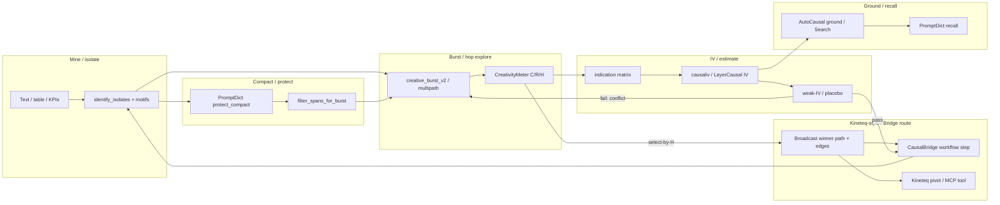

# Theory Bridge: Higher Cognition ↔ Burst/Meter ↔ Causal IV ↔ Kineteq Orchestration

**Status:** computational crosswalk (analogs, not identity)  
**Scope:** IntentIsolates creative burst + CreativityMeter + LayerCausalSuite ↔ Causal Fabric ↔ Kineteq-style orchestration  
**Companions:** [THEORY_HIGHER_COGNITION_GROUNDING.md](THEORY_HIGHER_COGNITION_GROUNDING.md) · [THEORY_CREATIVE_BURST_REASONING.md](THEORY_CREATIVE_BURST_REASONING.md) · [LAYER_CAUSAL_IV.md](LAYER_CAUSAL_IV.md) · [../../docs/GLOBAL_SYSTEM.md](../../docs/GLOBAL_SYSTEM.md)

**Caveats (read first):**
- Span hops are **not** human cognition; IV on layer motifs is **indication vs causation scaffolding**, not residual-stream causality.
- “Kineteq” on disk is mostly **adapters + MCP bus patterns**, not a full standalone product package.
- CausalBridge workflows today do **not** yet include an isolates-burst step (proposed below).

---

## 1. What exists on disk (inventory)

### Causal stack

| Artifact | Path / surface | Role |
| --- | --- | --- |
| CausalIVSuite | `research/CausalIVSuite/` (`causaliv`) | IV / DiD / validate; preferred `estimate_2sls` |
| AutoCausalLib | `research/AutoCausalLib/` | mine, discover, guides, ground, ML KPI loop |
| IntentIsolates causal | `intentisolates.causal` / `LayerCausalSuite` | layer motifs → indication matrix + IV edges |
| CausalSearch(+Pro) | `research/CausalSearch/` (+ Pro product) | question → DAG / evidence |
| CausalBridge | `research/CausalBridge/` | control plane: registry, workflows, health |
| Shared contracts | `research/shared_contracts/` | MineReport, CausalEdge, InsightPack, … |
| Global system | `research/docs/GLOBAL_SYSTEM.md` | Causal Fabric architecture |
| Compaction | `research/docs/ISOLATES_COMPACTION_REASONING.md` | protect spans ↔ PromptDict |

### Kineteq / orchestration (found vs stub)

| Artifact | Status | Notes |
| --- | --- | --- |
| `autocausal.guides.kineteq_guide.KineteqPivotEmbeddingGuide` | **Shipped adapter** | Tries `kineteq` / `kineteq_pivot` / `pivot_embeddings` modules → MCP `tools/call` → **local `pivot_fallback`** (explicitly *not* Kineteq) |
| Env flags | Documented | `AUTOCAUSAL_KINETEQ_MCP`, `KINETEQ_MCP_URL`, `KINETEQ_AUTH_TOKEN`; EmotiveVision aliases |
| EmotiveVision MCP bus | **Shipped pattern** | Kineteq-style JSON-RPC bus, live toggle, tool routing profiles |
| Standalone `kineteq` Python package | **Not on disk** | Guide comments state absence; fallback labeled |
| CausalBridge workflows | **No isolates/burst workflow yet** | Existing: `vision_causal`, `face_loop`, `equity_desk`, `full_twin`, `ops_check`, `datamine_all` |
| LLMIntent / IntentLoop MCP | Soft bus | Tool schemas for research workflows |
| SemanticExtractionLLms (Kineteq) | Referenced in LLMIntent README | Weight semantics / morpheme wells — external suite link |

**Framing used here:** *Kineteq-style orchestration* = tool routing + embedding pivots + workflow stages + report/morpheme pipelines — a **Global Workspace “broadcast”** analog for selecting the next specialist (IV, search, mine, affect), not a claim of product completeness.

---

## 2. Unified mapping table

| Higher cognition | IntentIsolates (burst/meter) | Causal objects | Kineteq / orchestration |
| --- | --- | --- | --- |
| System 1 explore | High \(C\): novelty, side-hops, divergent | Propose candidate instruments \(Z\), confounders, alternate \(X\) | Pivot-embed explore; soft guide suggestions |
| System 2 / control | High \(R\): anchors, protect, convergent | Validated edges; weak-IV / placebo gates | Route only after validation; compliance step |
| WM goal maintenance | \(p(s)=1\) protect spans | Keep outcome \(Y\) / constraint columns under compact | Preserve artifact fields across Bridge steps |
| WM load / compact | `filter_spans_for_burst` hot set | Estimate on remaining features | Artifact handoff size limits |
| GWT coalitions | `multipath_tot` paths | Competing \(Z\)–\(X\)–\(Y\) specs | Parallel dry-run tools / guides |
| GWT broadcast | Select-by-\(H\) winner path | Emit `CausalEdge` / InsightPack | Bridge workflow next stage; MCP tool call |
| Conflict monitoring | `anchor_schedule` | Re-validate when first-stage F collapses | Re-route on health / weak-IV alert |
| Structure-mapping | Motifs \(N_M\), `motif_jump` | Motif@layer features; typed paths | Pivot nearest-neighbor column maps |
| Insight side-hop | `side_hop_prob` | New instrument / alternate identification | Alternate guide backend (llmintent ↔ kineteq_pivot) |
| Problem-space operator | Hop \(\pi\) | IV operator / DiD contrast | Workflow step function |
| Metacognitive monitor | CreativityMeter \(R\), \(H\) | Weak-IV, placebo, sensitivity | Bridge health + audit certificate |
| Precision-weighted prior | `anchor_pull` | Strong instruments / high precision \(Z\) | High-confidence pivot matches |

### Symbol crosswalk (compact)

| Ours | Causal | Orchestration |
| --- | --- | --- |
| \(\mathcal{S}\), layers \(\ell\) | Feature columns; Z≈early, X≈mid/late, Y≈outcome | Catalog entities / KPI columns |
| \(\mathcal{M}\) | Motif@layer indication & IV edges | Association lists in guide context |
| \(P\), \(\pi\) | Exploration of identification strategies | Tool/policy choice |
| \(C\) | Instrument/confounder search breadth | Pivot diversity / alternate backends |
| \(R\) | Epistemic control (anchors ≈ constraints that must survive validation) | Gate before broadcast |
| \(H\) | Joint explore–validate score | Prefer next tool when both novel and reliable |

---

## 3. Creative burst / multipath ↔ causal identification

**Exploration (burst / high \(C\)):** sample alternate span typologies and motif neighborhoods ≈ propose **instruments**, **controls**, and **endogenous** candidates — analogous to InstrumentForge / guide suggestions, not yet identified effects.

**Exploitation (anchors / high \(R\)):** revisit protect goals/constraints ≈ lock the **estimand** and refuse paths that drop identification-critical spans.

**Multipath_tot:** competing identification narratives; CreativityMeter \(H\) is a cheap offline surrogate for “worth validating.” **Causal validate** (first-stage F, \(\beta_{IV}\), placebo) is the expensive specialist that should run on the broadcast winner — GWT receiving process.

**Indication ≠ causation:** LayerCausalSuite already separates Pearson indication from IV causation ([LAYER_CAUSAL_IV.md](LAYER_CAUSAL_IV.md)). Prediction **P10:** high-\(R\) paths should align more with **causation** matrices (and fail fewer weak-IV checks) than high-\(C\)-only divergent paths, which may inflate **indication**.

---

## 4. CreativityMeter \(R\) as epistemic control

| Meter / hop signal | Causal validation analog |
| --- | --- |
| `constraint_fidelity` / `anchor_R` | Spec survived compaction; required covariates present |
| `layer_monotonicity` | Coherent temporal/structural ordering of Z→X→Y story |
| Low \(R\) path | Likely weak design → expect weak first-stage / unstable \(\beta_{IV}\) |
| High \(H\) | Worth spending IV compute (explore *and* structured) |
| Placebo / sensitivity (causaliv / autocausal) | Metacognitive “should not find effect” checks — external to meter today |

Do **not** equate \(R\) with a significant \(\beta_{IV}\). \(R\) is a **structural prior** that the reasoning trace still contains the right kinds of spans; causal suites supply **statistical** control.

---

## 5. Unified orchestration loop



**Loop in words:** mine/isolate → (optional compact/protect) → burst/hop explore → meter select → IV/estimate + validate → ground/search → recall → Bridge/Kineteq route next tool → repeat.

Cognitive reading: explore = hypothesis sampling; protect = WM goals; meter = monitor; IV validate = epistemic control; Bridge/MCP = global broadcast to specialists.

---

## 6. Proposed Bridge / orchestration hooks (docs-level)

| Hook | Effort | Note |
| --- | --- | --- |
| Workflow id `isolates_burst_iv` (dry-run) | M | `intentisolates` multipath → LayerCausalSuite → artifact JSON |
| Guide note: prefer high-\(H\) path text as `context["text"]` for kineteq_pivot | S | Soft; no new package |
| `intentisolates.orchestration` stub | S | Optional thin module listing stages + schema flags (see below) |
| Emit `CausalEdge` from LayerCausal causation matrix into Bridge `--from` | M | Aligns with shared_contracts |

**Optional stub (preferred over heavy code):** document stages in results schema:

```json
{
  "orchestration": {
    "stage": "burst_explore|compact_protect|iv_estimate|bridge_route",
    "goal_neglect_under_compact": false,
    "select_by": "tradeoff_harmonic",
    "kineteq_backend": "pivot_fallback|kineteq_mcp|absent"
  }
}
```

---

## 7. Bridge propositions (adjudication targets)

| ID | Claim |
| --- | --- |
| **B1** | Burst-proposed \(Z\) candidates yield higher first-stage F than random span-as-instrument |
| **B2** | Paths with higher \(R\) show higher alignment with causation (vs indication-only) matrices |
| **B3** | Compact-protect → IV on remaining spans preserves more valid edges than truncate-then-IV |
| **B4** | Multipath select-by-\(H\) then IV validate beats random-path-then-IV on edge quality |
| **B5** | Meter-gated Bridge/Kineteq route (dry-run) chooses a more coherent next tool than ungated |

**Empirical (theory_corpus_sweep 2026-07-09):** B1/B2 mock-IV checks recorded as *supported* at **weak** strength only (identical F / zero name-overlap) — treat as **inconclusive for identification**. B4 (multipath_H R ≥ random R) **supported (strong)** as a structural prior, not a substitute for weak-IV tests. B3/B5 still untested. Queue: [NEXT_EXPERIMENTS_HIGHER_COGNITION.md](NEXT_EXPERIMENTS_HIGHER_COGNITION.md) · evidence: [CLAIM_EVIDENCE_TABLE.md](../experiments/results/CLAIM_EVIDENCE_TABLE.md).

---

## 8. References / pointers

- Layer IV design: [LAYER_CAUSAL_IV.md](LAYER_CAUSAL_IV.md)  
- Fabric: [GLOBAL_SYSTEM.md](../../docs/GLOBAL_SYSTEM.md), [GLOBAL_SYSTEM_PROPOSALS.md](../../GLOBAL_SYSTEM_PROPOSALS.md)  
- Kineteq guide: `AutoCausalLib/src/autocausal/guides/kineteq_guide.py`  
- EmotiveVision MCP: `EmotiveVision/README.md`  
- Compaction: [ISOLATES_COMPACTION_REASONING.md](../../docs/ISOLATES_COMPACTION_REASONING.md)
