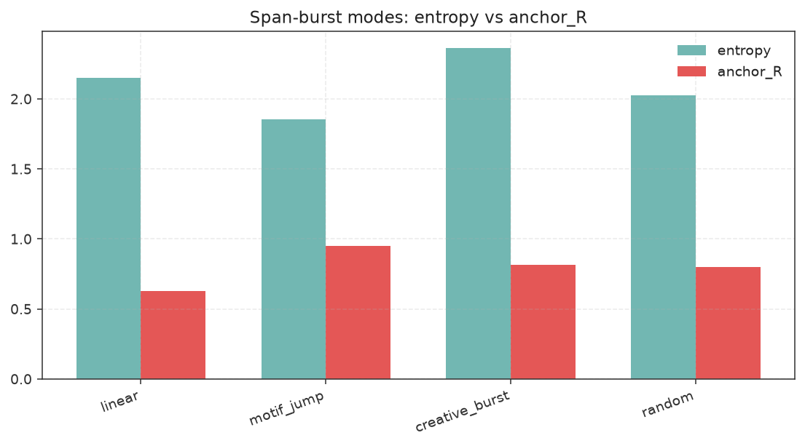

# Compiled Experimentation — 2026-07-09

Fresh offline reruns compiled into master tables. Timestamps UTC.

## Commands run

```bash
python experiments/span_burst_creative.py
python experiments/lit_review_burst_experiments.py
python experiments/theory_corpus_sweep.py --seeds 5 --hops 5
python experiments/plot_results.py
# sibling:
python ../PromptDictCompress/experiments/reasoning_trace_compaction.py
```

## Artifact paths

| Artifact | Path |
| --- | --- |
| Span burst | `experiments/results/span_burst_20260709T234812Z.md` (+ `_latest`) |
| Lit burst | `experiments/results/lit_burst_20260709T234812Z.md` (+ `_latest`) |
| Theory sweep | `experiments/results/theory_corpus_sweep_20260709T235036Z.md` (+ `_latest`) |
| Claim evidence | `experiments/results/CLAIM_EVIDENCE_TABLE.md` |
| Compaction | `../PromptDictCompress/experiments/results/reasoning_compaction_20260709T234933Z.md` |
| Charts | `experiments/results/charts/` · index `CHARTS.md` |
| Full report | `docs/COMPREHENSIVE_EXPERIMENTAL_FINDINGS_REPORT.md` |

---

## 1. Lit-burst (CreativityMeter) — NEW

Fixtures: 4 · hops: 5 · seeds: 3 offsets · stamp `20260709T234812Z`

| condition | C | R | H | entropy | anchor_R | layer_mono |
| --- | ---: | ---: | ---: | ---: | ---: | ---: |
| linear | 0.688 | 0.645 | 0.657 | 2.147 | 0.625 | 0.683 |
| random | 0.702 | 0.705 | 0.687 | 2.119 | 0.743 | 0.633 |
| motif_jump | 0.590 | 0.956 | 0.725 | 1.855 | 0.950 | 0.967 |
| creative_burst_v1 | 0.778 | 0.721 | 0.745 | 2.363 | 0.812 | 0.550 |
| divergent_guilford | 0.786 | 0.654 | 0.705 | 2.474 | 0.738 | 0.500 |
| convergent_constrained | 0.644 | 0.907 | 0.747 | 1.939 | 1.000 | 0.733 |
| novelty_boden | 0.745 | 0.751 | 0.743 | 2.335 | 0.850 | 0.567 |
| layer_cot | 0.667 | 0.895 | 0.755 | 2.022 | 1.000 | 0.700 |
| creative_burst_v2 | 0.706 | 0.820 | 0.751 | 2.165 | 0.929 | 0.617 |
| **multipath_tot** | **0.713** | **0.841** | **0.768** | 2.213 | 0.917 | 0.700 |

**Best H:** multipath_tot (0.768) > layer_cot (0.755) > creative_burst_v2 (0.751)


---

## 2. Span-burst modes — NEW

| mode | entropy | anchor_R | coverage |
| --- | ---: | ---: | ---: |
| linear | 2.147 | 0.625 | 0.735 |
| motif_jump | 1.855 | 0.950 | 0.735 |
| creative_burst (v1) | 2.363 | 0.812 | 0.735 |
| random | 2.026 | 0.799 | 0.735 |



---

## 3. Theory corpus sweep — NEW

Fixtures: **8** · seeds: **5** · hops: 5 · conditions: 21 · stamp `20260709T235036Z`

| condition | C | R | H | entropy | anchor_R |
| --- | ---: | ---: | ---: | ---: | ---: |
| linear | 0.657 | 0.671 | 0.652 | 2.025 | 0.626 |
| random | 0.678 | 0.740 | 0.700 | 2.107 | 0.726 |
| motif_jump | 0.566 | 0.900 | 0.691 | 1.773 | 0.856 |
| creative_burst_v1 | 0.768 | 0.754 | 0.756 | 2.352 | 0.854 |
| divergent_guilford | 0.761 | 0.731 | 0.734 | 2.402 | 0.810 |
| convergent_constrained | 0.657 | 0.903 | 0.755 | 2.011 | 0.991 |
| layer_cot | 0.712 | 0.826 | 0.758 | 2.225 | 0.918 |
| creative_burst_v2 | 0.728 | 0.796 | 0.754 | 2.290 | 0.886 |
| precision_high | 0.671 | 0.891 | 0.758 | 2.052 | 0.991 |
| precision_low | 0.755 | 0.740 | 0.737 | 2.377 | 0.826 |
| insight_sidehop | 0.739 | 0.777 | 0.750 | 2.318 | 0.862 |
| conflict_schedule_2 | 0.688 | 0.875 | 0.763 | 2.123 | 0.970 |
| multipath_k3_H | 0.725 | 0.826 | 0.768 | 2.259 | 0.923 |
| multipath_k5_H | 0.721 | 0.836 | 0.769 | 2.247 | 0.928 |
| multipath_k5_C | 0.769 | 0.734 | 0.748 | 2.402 | 0.833 |
| multipath_k5_R | 0.697 | 0.852 | 0.760 | 2.194 | 0.933 |
| multipath_k7_H | 0.725 | 0.839 | **0.774** | 2.279 | 0.913 |
| incubation_alt | 0.701 | 0.686 | 0.691 | 1.907 | 0.746 |
| two_phase | 0.690 | 0.784 | 0.728 | 1.980 | 0.867 |
| wm_protect_hotset | 0.727 | 0.799 | 0.755 | 2.265 | 0.890 |
| wm_truncate_drop | 0.736 | 0.846 | 0.778 | 1.875 | 1.000 |


---

## 4. Compaction (PromptDictCompress) — NEW

Budget 1200 · fixtures 5 · stamp `20260709T234933Z`

| condition | tok_after | ratio | mid_constraint_R | motif_J | gold_R_vis |
| --- | ---: | ---: | ---: | ---: | ---: |
| raw | 2846.4 | 1.000 | 1.000 | 1.000 | 1.000 |
| compress | 1947.4 | 1.462 | 1.000 | 1.000 | 1.000 |
| compact | 1428.0 | 1.993 | 0.733 | 0.038 | 0.867 |
| lossy_truncate | 124.6 | 22.873 | 0.200 | 0.066 | 0.600 |
| **protect_compact** | 185.6 | 15.362 | **1.000** | 0.007 | **1.000** |


---

## 5. Claim evidence summary

**29 checks:** supported **24** · rejected **5** · mixed **0** · untested **0**


Full table: [`CLAIM_EVIDENCE_TABLE.md`](CLAIM_EVIDENCE_TABLE.md)

### Rejected (honest)

| ID | Why |
| --- | --- |
| P6a/P6b | Offline truncate sim beat protect on R/anchor_R (pool-size artifact; see report Limitations) |
| P8b | Side-hop R drop vs convergent > 0.08 |
| I1 | Incubation H < divergent |
| I2 | Two-phase H < v2 |

### Strongest support (Δ / wins)

P2 anchor_R v2>random (+0.16, 7/8) · P4 dual-process C/entropy · PP1/PP2 precision · G1 select-by-H>C on R · S1/S3 · L1b motif C≪v2 · P3 layer_cot mono
